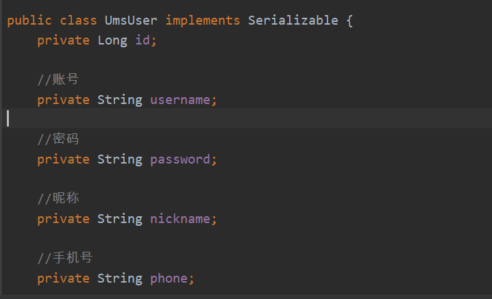

# 介绍

​	*MyBatis Genera*tor是一款mybatis自动代码生成工具，也就是逆向工程。它可以通过配置由数据库的表自动生成实体类、Mapper接口和对应的xml文件，且提供了常用的增删改查方法。还能生成对应的example类，他能像jpa一样通过调用的函数名去做一些条件查询。[Mybatis Generator 官网](<http://mybatis.org/generator/index.html>)

​	本项目是一个基础工程，可下载后根据教程**移植**入自己的项目中进行使用。

## 项目环境

- Intellij IDEA 2019
- Spring Boot 2.2.4

# 使用

## 数据库和表

​	既然是逆向工程，那就需要先有数据库数据表，本项目连接的是**MySQL**。

​	强烈建议在定义数据库、表、字段全部采用**全小写下划线命名法**，特别是字段名。不要出现大写！！！

> **为啥不要大写？**
>
> **在Linux下：**
>
> 1、数据库名与表名是严格区分大小写的；
> 2、表的别名是严格区分大小写的；
> 3、列名与列的别名在所有的情况下均是忽略大小写的；
> 4、变量名也是严格区分大小写的；
>
> **在Windows下：**
>
> 全部不区分大小写

## 导入依赖

在自己的项目中添加依赖

pom.xml

~~~xml
<!-- MySQL -->
<dependency>
    <groupId>mysql</groupId>
    <artifactId>mysql-connector-java</artifactId>
    <scope>runtime</scope>
</dependency>
<!-- Mybatis -->
<dependency>
    <groupId>org.mybatis.spring.boot</groupId>
    <artifactId>mybatis-spring-boot-starter</artifactId>
    <version>2.1.1</version>
</dependency>
<!-- MyBatis 生成器 -->
<dependency>
    <groupId>org.mybatis.generator</groupId>
    <artifactId>mybatis-generator-core</artifactId>
    <version>1.3.3</version>
</dependency>
<!-- swagger2 生成的注释如果要swagger格式的要添加，可看拓展 -->
<dependency>
    <groupId>io.springfox</groupId>
    <artifactId>springfox-swagger2</artifactId>
    <version>2.7.0</version>
</dependency>
~~~

## 移植工程所需的文件

1. 到项目的github仓库把项目拉下来，把下列文件移到自己的项目中，根据自己的项目进行修改（也可以自己创建这些文件，代码下面都会贴）。

2. 修改配置文件**generatorConfig.xml**，标序号的是要修改的，主要是包名。

   ~~~xml
   <?xml version="1.0" encoding="UTF-8"?>
   <!DOCTYPE generatorConfiguration
           PUBLIC "-//mybatis.org//DTD MyBatis Generator Configuration 1.0//EN"
           "http://mybatis.org/dtd/mybatis-generator-config_1_0.dtd">
   
   <generatorConfiguration>
       <properties resource="generator.properties"/>
       <context id="MySqlContext" targetRuntime="MyBatis3" defaultModelType="flat">
           <property name="beginningDelimiter" value="`"/>
           <property name="endingDelimiter" value="`"/>
           <property name="javaFileEncoding" value="UTF-8"/>
           <!--1.覆盖新生成Mapper文件（覆盖上一次自动生成配置类的位置，我们包名肯定不一样！）-->
           <plugin type="com.money.mybatisgenerator.mbg.OverIsMergeablePlugin"/>
           <!-- 为模型生成序列化方法 （看你要不要！web前后端传递序列化还是搞一下把））-->
           <plugin type="org.mybatis.generator.plugins.SerializablePlugin"/>
           <!-- 为生成的Java模型创建一个toString方法（看你要不要！） -->
           <plugin type="org.mybatis.generator.plugins.ToStringPlugin"/>
           <!--2.使用CommentGenerator类，可以根据数据库注释生成注释（我们包名不一样！） -->
           <commentGenerator type="com.money.mybatisgenerator.mbg.CommentGenerator">
               <!-- 是否去除自动生成的注释 true：是 ： false:否 -->
               <property name="suppressAllComments" value="true"/>
               <property name="suppressDate" value="true"/>
               <property name="addRemarkComments" value="true"/>
           </commentGenerator>
           <!--配置数据库连接-->
           <jdbcConnection driverClass="${jdbc.driverClass}" connectionURL="${jdbc.connectionURL}" userId="${jdbc.userId}"
                           password="${jdbc.password}">
               <!--解决mysql驱动升级到8.0后不生成指定数据库代码的问题-->
               <property name="nullCatalogMeansCurrent" value="true"/>
           </jdbcConnection>
           <!--3.指定生成model的路径（我们包名不一样！）-->
           <javaModelGenerator targetPackage="com.money.mybatisgenerator.mbg.model" targetProject="src\main\java">
               <property name="enableSubPackages" value="true"/>
               <property name="trimStrings" value="true"/>
           </javaModelGenerator>
           <!--4.指定生成mapper.xml的路径（我们包名不一样！）-->
           <sqlMapGenerator targetPackage="com.money.mybatisgenerator.mbg.mapper" targetProject="src\main\resources">
               <property name="enableSubPackages" value="true"/>
           </sqlMapGenerator>
           <!--5.指定生成mapper接口的的路径（我们包名不一样！这里对应的算resources里的）-->
           <javaClientGenerator type="XMLMAPPER" targetPackage="com.money.mybatisgenerator.mbg.mapper"
                                targetProject="src\main\java">
               <property name="enableSubPackages" value="true"/>
           </javaClientGenerator>
           <!--6.如果不用example类，就使用这个<table>标签-->
           <!--<table tableName="${jdbc.tableName}" enableCountByExample="false" enableUpdateByExample="false" enableDeleteByExample="false"-->
           <!--enableSelectByExample="false" selectByExampleQueryId="false" />-->
           <table tableName="${jdbc.tableName}"/>
       </context>
   </generatorConfiguration>
   ~~~

   3. 修改数据库配置参数**generatorConfig.properties**，它是填数据库信息的，都要改。

   ~~~properties
   # 驱动
   jdbc.driverClass=com.mysql.cj.jdbc.Driver  
   # 数据库连接
   jdbc.connectionURL=jdbc:mysql://localhost:3306/数据库名?useUnicode=true&characterEncoding=utf-8&serverTimezone=GMT%2b8&useSSL=false
   # 数据库账号
   jdbc.userId=root
   # 数据库密码
   jdbc.password=root
   # 要自动生成的表名 %是全部
   #jdbc.tableName=%
   jdbc.tableName=表名
   ~~~

   4. 生成入口类**Generator**类，运行main函数就启动了，就配置文件的路径你如果没按我的放可能要修改一下路径，其他不变。

   ~~~java
   public class Generator {
   
       public static void main(String[] args) throws Exception {
           //MBG 执行过程中的警告信息
           List<String> warnings = new ArrayList<String>();
           //当生成的代码重复时，覆盖原代码
           boolean overwrite = true;
           //读取我们的 MBG 配置文件
           InputStream is = Generator.class.getResourceAsStream("/generatorConfig.xml");
           ConfigurationParser cp = new ConfigurationParser(warnings);
           Configuration config = cp.parseConfiguration(is);
           is.close();
   
           DefaultShellCallback callback = new DefaultShellCallback(overwrite);
           //创建 MBG
           MyBatisGenerator myBatisGenerator = new MyBatisGenerator(config, callback, warnings);
           //执行生成代码
           myBatisGenerator.generate(null);
           //输出警告信息
           for (String warning : warnings) {
               System.out.println(warning);
           }
       }
   }
   ~~~

   5. 覆盖配置类**OverIsMergeablePlugin**，不用改

   ~~~java
   public class OverIsMergeablePlugin extends PluginAdapter {
       @Override
       public boolean validate(List<String> warnings) {
           return true;
       }
   
       @Override
       public boolean sqlMapGenerated(GeneratedXmlFile sqlMap, IntrospectedTable introspectedTable) {
           try {
               Field field = sqlMap.getClass().getDeclaredField("isMergeable");
               field.setAccessible(true);
               field.setBoolean(sqlMap, false);
           } catch (Exception e) {
               e.printStackTrace();
           }
           return true;
       }
   }
   ~~~

   6. 自定义注释生成器**CommentGenerator**，就是数据库里字段如果有注释，他会帮你填进去。

      

      ~~~java
      /**
       * 自定义注释生成器
       */
      public class CommentGenerator extends DefaultCommentGenerator {
          private boolean addRemarkComments = false;
          private static final String EXAMPLE_SUFFIX = "Example";
      
          /**
           * 设置用户配置的参数
           */
          @Override
          public void addConfigurationProperties(Properties properties) {
              super.addConfigurationProperties(properties);
              this.addRemarkComments = StringUtility.isTrue(properties.getProperty("addRemarkComments"));
          }
      
          /**
           * 给字段添加注释
           */
          @Override
          public void addFieldComment(Field field, IntrospectedTable introspectedTable,
                                      IntrospectedColumn introspectedColumn) {
              String remarks = introspectedColumn.getRemarks();
              //根据参数和备注信息判断是否添加备注信息
              if (addRemarkComments && StringUtility.stringHasValue(remarks)) {
      //            addFieldJavaDoc(field, remarks);
                  //数据库中特殊字符需要转义
                  if (remarks.contains("\"")) {
                      remarks = remarks.replace("\"", "'");
                  }
                  //给model的字段添加注解
                  field.addJavaDocLine("//" + remarks);
              }
          }
      
          /**
           * 给model的字段添加注释
           */
          private void addFieldJavaDoc(Field field, String remarks) {
              //文档注释开始
              field.addJavaDocLine("/**");
              //获取数据库字段的备注信息
              String[] remarkLines = remarks.split(System.getProperty("line.separator"));
              for (String remarkLine : remarkLines) {
                  field.addJavaDocLine(" * " + remarkLine);
              }
              addJavadocTag(field, false);
              field.addJavaDocLine(" */");
          }
      
      }
      ~~~

## 运行

​	最后就是运行Generator类中的main函数就行了！

# 小拓展

## 自动生成注释，本文是用的 // 注释，还可以使用swagger进行注释

​	仓库里的项目使用的就是swagger进行注释，要导入swagger依赖

~~~xml
<dependency>
    <groupId>io.springfox</groupId>
    <artifactId>springfox-swagger2</artifactId>
    <version>2.7.0</version>
</dependency>
~~~

​	修改自定义注释生成器**CommentGenerator**

~~~java
/**
 * 自定义注释生成器
 */
public class CommentGenerator extends DefaultCommentGenerator {
    private boolean addRemarkComments = false;
    private static final String EXAMPLE_SUFFIX = "Example";
    private static final String API_MODEL_PROPERTY_FULL_CLASS_NAME = "io.swagger.annotations.ApiModelProperty";

    /**
     * 设置用户配置的参数
     */
    @Override
    public void addConfigurationProperties(Properties properties) {
        super.addConfigurationProperties(properties);
        this.addRemarkComments = StringUtility.isTrue(properties.getProperty("addRemarkComments"));
    }

    /**
     * 给字段添加注释
     */
    @Override
    public void addFieldComment(Field field, IntrospectedTable introspectedTable,
                                IntrospectedColumn introspectedColumn) {
        String remarks = introspectedColumn.getRemarks();
        //根据参数和备注信息判断是否添加备注信息
        if (addRemarkComments && StringUtility.stringHasValue(remarks)) {
//            addFieldJavaDoc(field, remarks);
            //数据库中特殊字符需要转义
            if (remarks.contains("\"")) {
                remarks = remarks.replace("\"", "'");
            }
            //给model的字段添加swagger注解
            field.addJavaDocLine("@ApiModelProperty(value = \"" + remarks + "\")");
        }
    }

    /**
     * 给model的字段添加注释
     */
    private void addFieldJavaDoc(Field field, String remarks) {
        //文档注释开始
        field.addJavaDocLine("/**");
        //获取数据库字段的备注信息
        String[] remarkLines = remarks.split(System.getProperty("line.separator"));
        for (String remarkLine : remarkLines) {
            field.addJavaDocLine(" * " + remarkLine);
        }
        addJavadocTag(field, false);
        field.addJavaDocLine(" */");
    }

    @Override
    public void addJavaFileComment(CompilationUnit compilationUnit) {
        super.addJavaFileComment(compilationUnit);
        //只在model中添加swagger注解类的导入
        if (!compilationUnit.isJavaInterface() && !compilationUnit.getType().getFullyQualifiedName().contains(EXAMPLE_SUFFIX)) {
            compilationUnit.addImportedType(new FullyQualifiedJavaType(API_MODEL_PROPERTY_FULL_CLASS_NAME));
        }
    }

}
~~~

​	然后就变成这样了。。。。

## example类

​	mybatis-generator会为每个字段产生Criterion，为底层的mapper.xml创建动态sql。如果表的字段比较多,产生的example类会十分庞大。理论上通过example类可以构造你想到的任何筛选条件。我也不太会用，简单的话可以参考https://zhuanlan.zhihu.com/p/42411540这篇。

