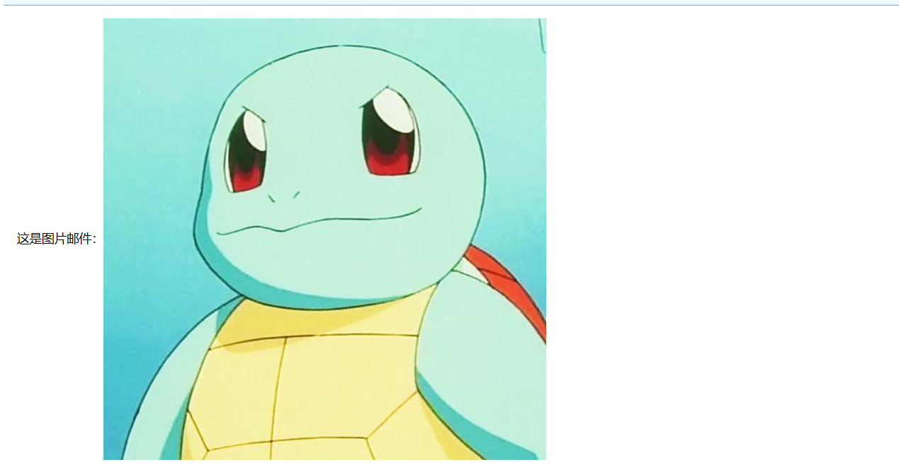

# 基础知识

## 使用场景

- 注册验证（可以发验证码让用户填，或直接给链接激活）
- 忘记密码，通过邮箱找回
- 通知、提醒等
- 触发机制（结合定时等去发邮件）
- 发广告。。。

## 邮件发送原理

- 邮箱传输协议

  - SMTP（简单邮件传输协议）【发送】：一组用于从源地址到目的地址传输邮件的规范，通过它来控制邮件的中转方式。
  - POP 3（邮局协议）【接收】：规定怎样将个人计算机连接到Internet的邮件服务器和下载电子邮件的电子协议。

  

- 不断发展：IMAP协议（对POP 3的补充）和Mime协议

## 邮件发送流程

# 搭建系统

## 开发环境

- Intellij IDEA 2019
- Spring Boot 2.2.4

创建一个Spring Boot的Maven项目，项目最终结构总览：

## 导入依赖

pom.xml

~~~xml
<dependencies>
    <dependency>
        <groupId>org.springframework.boot</groupId>
        <artifactId>spring-boot-starter-web</artifactId>
    </dependency>
	<dependency>
        <groupId>org.springframework.boot</groupId>
        <artifactId>spring-boot-starter-thymeleaf</artifactId>
    </dependency>
    <dependency>
        <groupId>org.springframework.boot</groupId>
        <artifactId>spring-boot-starter-mail</artifactId>
    </dependency>
	<!-- 邮件 -->
    <dependency>
        <groupId>org.springframework.boot</groupId>
        <artifactId>spring-boot-starter-test</artifactId>
        <scope>test</scope>
        <exclusions>
            <exclusion>
                <groupId>org.junit.vintage</groupId>
                <artifactId>junit-vintage-engine</artifactId>
            </exclusion>
        </exclusions>
    </dependency>
</dependencies>
~~~

## 项目配置

application.yml

~~~yml
spring:
  mail:
    host: smtp.qq.com # 配置协议，这里使用的QQ邮箱
    username: 374648769@qq.com # 作为发件人
    password:  # 授权码（去QQ邮箱获取的，并非登录密码）
    default-encoding: utf-8 # 邮件的默认编码
    fromAlias: Money # 设置发件人别名
~~~

QQ邮箱授权码获取方式：https://service.mail.qq.com/cgi-bin/help?subtype=1&no=1001256&id=28

## Service

mailService 接口

~~~java
public interface MailService {

    /**
     * 发送普通文本邮件
     * @param to 收件人
     * @param subject 主题
     * @param content 内容
     * @return
     */
    boolean sendSimpleMail(String to, String subject, String content);

    /**
     * 发送Html邮件
     * @param to 收件人
     * @param subject 主题
     * @param content 内容
     * @return
     */
    boolean sendHtmlMail(String to, String subject, String content);

    /**
     * 发送带附件的邮件
     * @param to 收件人
     * @param subject 主题
     * @param content 内容
     * @param filePath 附件路径
     */
    boolean sendAttachmentsMail(String to, String subject, String content, String filePath);

    /**
     * 发送图片邮件
     * @param to 收件人
     * @param subject 主题
     * @param content 内容
     * @param rscPath
     * @param rscId
     */
    boolean sendInlineResourceMail(String to, String subject, String content, String rscPath, String rscId);
}

~~~

mailServiceImpl 实现类

~~~java
@Service
public class MailServiceImpl implements MailService {

    private final Logger logger = LoggerFactory.getLogger(this.getClass());

    @Autowired
    private JavaMailSender mailSender;
    @Value("${spring.mail.username}")
    private String from;    // 发件人邮箱
    @Value("${spring.mail.fromAlias}")
    private String fromAlias;   // 发件人别名（使用其他名称）

    @Override
    public boolean sendSimpleMail(String to, String subject, String content) {
        try {
            logger.info("发送普通文本邮件：{},{},{}", to, subject, content);
            SimpleMailMessage message = new SimpleMailMessage();
            // 要使用别名，必须进行拼接转换
            String fromByte = new String((fromAlias + " <" + from + ">")
                    .getBytes("UTF-8"));
            message.setFrom(fromByte);
//            message.setFrom(from); // 可不使用别名，这样发件人那里会写发件人的邮箱
            message.setTo(to);
            message.setSubject(subject);
            message.setText(content);
            mailSender.send(message);
            logger.info("发送普通文本邮件成功！");
        } catch (Exception e){
            logger.error("发送普通文本邮件失败：", e);
            return false;
        }
        return true;
    }

    @Override
    public boolean sendHtmlMail(String to, String subject, String content) {
        try {
            logger.info("发送Html邮件：{},{},{}", to, subject, content);
            MimeMessage message = mailSender.createMimeMessage();
            MimeMessageHelper helper = new MimeMessageHelper(message, true);
            String fromByte = new String((fromAlias + " <" + from + ">")
                    .getBytes("UTF-8"));
            helper.setFrom(fromByte);
            helper.setTo(to);
            helper.setSubject(subject);
            helper.setText(content, true); // 开启html转换
            mailSender.send(message);
            logger.info("发送Html邮件成功！");
        } catch (Exception e){
            logger.error("发送Html邮件失败：", e);
            return false;
        }
        return true;
    }

    @Override
    public boolean sendAttachmentsMail(String to, String subject, String content, String filePath) {
        try {
            logger.info("发送带附件的邮件：{},{},{},{}", to, subject, content, filePath);
            MimeMessage message = mailSender.createMimeMessage();
            MimeMessageHelper helper = new MimeMessageHelper(message, true);
            String fromByte = new String((fromAlias + " <" + from + ">")
                    .getBytes("UTF-8"));
            helper.setFrom(fromByte);
            helper.setTo(to);
            helper.setSubject(subject);
            helper.setText(content, true);
            FileSystemResource file = new FileSystemResource(new File(filePath));
            // 多附件只要传入文件数组，一个一个addAttachment就可以了
            String fileName = filePath.substring(filePath.lastIndexOf(File.separator)); // 获取文件名
            helper.addAttachment(fileName, file);
            mailSender.send(message);
            logger.info("发送带附件的邮件成功！");
        } catch (Exception e){
            logger.error("发送带附件的邮件失败：", e);
            return false;
        }
        return true;
    }

    @Override
    public boolean sendInlineResourceMail(String to, String subject, String content, String rscPath, String rscId) {
        try {
            logger.info("发送图片邮件：{},{},{},{},{}", to, subject, content, rscPath, rscId);
            MimeMessage message = mailSender.createMimeMessage();
            MimeMessageHelper helper = new MimeMessageHelper(message, true);
            String fromByte = new String((fromAlias + " <" + from + ">")
                    .getBytes("UTF-8"));
            helper.setFrom(fromByte);
            helper.setTo(to);
            helper.setSubject(subject);
            helper.setText(content, true);
            FileSystemResource res = new FileSystemResource(new File(rscPath));
            helper.addInline(rscId, res);
            mailSender.send(message);
            logger.info("发送图片邮件成功！");
        } catch (Exception e){
            logger.error("发送图片邮件失败：", e);
            return false;
        }
        return true;
    }
}
~~~

## Controller 

​	controller可以根据自己的需求去更改，本文所有的内容主题都有服务端也就是在controller里直接提供了。

~~~java
@Controller
@RequestMapping("/mail")
public class MailController {

    @Autowired
    private MailService mailService;

    @RequestMapping("/simpleMail")
    @ResponseBody
    public String sendSimpleMail(String email) {
        String subject = "麦尼的邮件系统";
        String content = "这是一封普通文本邮件";
        if (mailService.sendSimpleMail(email, subject, content)) {
            return "发送成功";
        } else {
            return "发送失败";
        }
    }

    @RequestMapping("/htmlMail")
    @ResponseBody
    public String sendHtmlMail(String email) {
        String subject = "麦尼的邮件系统";
        StringBuilder content = new StringBuilder();
        content.append("<html>\n")
                .append("<body>\n")
                .append("<h1>大标题</h1>\n")
                .append("</body>\n")
                .append("</html>\n");
        if (mailService.sendHtmlMail(email, subject, content.toString())) {
            return "发送成功";
        } else {
            return "发送失败";
        }
    }

    @RequestMapping("/attachmentsMail")
    @ResponseBody
    public String sendAttachmentsMail(String email) {
        String subject = "麦尼的邮件系统";
        String content = "带附件的邮件";
        String filePath = "F:\\1.txt";
        if (mailService.sendAttachmentsMail(email, subject, content, filePath)) {
            return "发送成功";
        } else {
            return "发送失败";
        }
    }

    @RequestMapping("/inlineResourcesMail")
    @ResponseBody
    public String sendInlineResourceMail(String email) {
        String subject = "麦尼的邮件系统";
        String imgPath = "F:\\person.jpg";
        String imgId = "001";
        StringBuilder content = new StringBuilder();
        content.append("<html>\n")
                .append("<body>\n")
                .append("这是图片邮件：")
                .append("</body>\n")
                .append("</html>\n");
        if (mailService.sendInlineResourceMail(email, subject, content.toString(), imgPath, imgId)) {
            return "发送成功";
        } else {
            return "发送失败";
        }
    }
}
~~~

## 测试

mail.html

~~~html
<!DOCTYPE html>
<html lang="en">
<head>
    <meta charset="UTF-8">
    <title>邮件系统</title>
<!--    引入Jquery-->
    
</head>
<body>
    收件人：<input id="email" value="374648769@qq.com"> 
    <button id="simpleMail">发送普通文本邮件</button>  
    <button id="htmlMail">发送Html邮件</button>  
    <button id="attachmentsMail">发送带附件邮件</button>  
    <button id="inlineResourcesMail">发送图片邮件</button>  

</body>

</html>
~~~

浏览：http://127.0.0.1:8080/mail.html

测试结果：

# 邮件模板

​	其实很多邮件内容并不会变化，如注册激活邮件、忘记密码等，只是收件人不一样，像这些就很适合用模板邮件。它需要模板引擎的支持，我们使用Thymeleaf。

## 引入Thymeleaf依赖

~~~xml
<dependency>
    <groupId>org.springframework.boot</groupId>
    <artifactId>spring-boot-starter-thymeleaf</artifactId>
</dependency>
~~~

## 新建邮件模板

mailTemplate.html

~~~html
<!DOCTYPE html>
<!--声明为Thymeleaf-->
<html lang="en" xmlns:th="http://www.thymeleaf.org">
<head>
    <meta charset="UTF-8">
    <title>邮件模板</title>
</head>
<body>
    您好，感谢您的注册，这是一封验证邮件，请点击下面链接进行验证完成注册，感谢您的支持！
    <a href="#" th:href="@{http://127.0.0.1:8080/register/{username}(username=${username})}">激活</a>
</body>
</html>
~~~

## controller

service还是那个service，把上部分的其他controller删掉看得比较清楚。

~~~java
@Controller
@RequestMapping("/mail")
public class MailController {

    @Autowired
    private MailService mailService;

    @Autowired
    private TemplateEngine templateEngine;

    /**
     *  使用模板邮件
     */
    @RequestMapping("/mailTemplate")
    @ResponseBody
    public String sendMailTemplate(String email) {
        Context context = new Context(); // 不要import错了，要是Thymeleaf包内的
        context.setVariable("username", "user001"); // 这里就是填充模板上的那个username
        String content = templateEngine.process("mailTemplate", context); // 读出html的文本

        String subject = "麦尼邮件系统";
        if (mailService.sendHtmlMail(email, subject, content)) {
            return "发送成功";
        } else {
            return "发送失败";
        }
    }
}

~~~

## 测试

mail.html

~~~html
<!DOCTYPE html>
<html lang="en">
<head>
    <meta charset="UTF-8">
    <title>邮件系统</title>
<!--    引入Jquery-->
    
</head>
<body>
    收件人：<input id="email" value="374648769@qq.com"> 
    <button id="simpleMail">发送普通文本邮件</button>  
    <button id="htmlMail">发送Html邮件</button>  
    <button id="attachmentsMail">发送带附件邮件</button>  
    <button id="inlineResourcesMail">发送图片邮件</button>  
    <button id="mailTemplate">发送模板邮件</button>  

</body>

</html>
~~~

测试结果：

点击激活：

# 常见错误

- 421 HL:ICC 该IP同时并发连接数过大
- 451 Request mail action not taken:too much fail ... 登录失败次数过多，被临时禁止登录，你号没了！
- 553 authentication is required 认证失败，检查配置，那个password不是登录密码，是授权码！要去QQ邮箱拿，其他类型的邮箱也都不一样，自行百度获取。